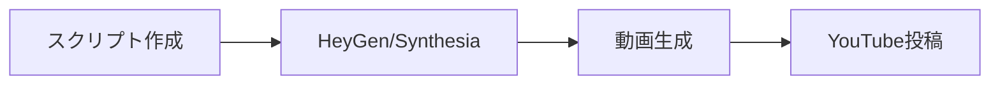
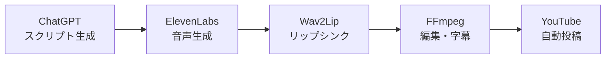
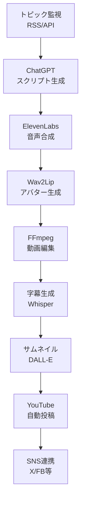

# YouTube向けAIアバター実装プラン

**目的**: YouTubeチャンネルでの動画コンテンツ制作の自動化・効率化

---

## 目次

- [1. YouTube向けAIアバターの要件](#1-youtube向けaiアバターの要件)
- [2. 推奨技術スタック](#2-推奨技術スタック)
- [3. 実装パターン比較](#3-実装パターン比較)
- [4. 推奨ワークフロー](#4-推奨ワークフロー)
- [5. コスト試算](#5-コスト試算)
- [6. 実装ロードマップ](#6-実装ロードマップ)
- [7. YouTube最適化のポイント](#7-youtube最適化のポイント)
- [8. 次のアクション](#8-次のアクション)

---

## 1. YouTube向けAIアバターの要件

### YouTube特有の要件

```yaml
動画品質:
  解像度: 1080p (1920x1080) 以上推奨、4K対応も検討
  アスペクト比: 16:9（横型）が基本、YouTube Shorts用に 9:16（縦型）も
  フレームレート: 30fps or 60fps
  ビットレート: 高品質（8-12 Mbps for 1080p）

動画尺:
  通常動画: 5-20分（最適は8-12分）
  YouTube Shorts: 60秒以内（縦型）

音声品質:
  サンプルレート: 48kHz
  ビットレート: 128-192 kbps
  ステレオ音声推奨

その他:
  字幕・キャプション: 必須（SEO効果大）
  サムネイル: 自動生成 or 手動作成
  メタデータ: タイトル、説明文、タグの最適化
```

### コンテンツタイプ別の要件

#### パターンA: 解説・教育系チャンネル
```
特徴:
  - トーキングヘッド形式（バストショット）
  - スライド・図解との組み合わせ
  - 5-15分の尺

必要な機能:
  ✅ 安定した品質のアバター
  ✅ 長尺対応（15分以上）
  ✅ スクリーン共有・スライド表示機能
  ✅ 自動字幕生成
```

#### パターンB: ニュース・情報発信系
```
特徴:
  - 短めの動画（3-8分）
  - 高頻度投稿（毎日 or 週3-5本）
  - トレンド対応が重要

必要な機能:
  ✅ 高速生成（1時間以内）
  ✅ バッチ処理対応
  ✅ テンプレート化
  ✅ API経由での自動化
```

#### パターンC: エンタメ・ショート動画
```
特徴:
  - YouTube Shorts（60秒以内）
  - 縦型動画（9:16）
  - 毎日複数投稿

必要な機能:
  ✅ 超高速生成
  ✅ 縦型フォーマット対応
  ✅ 大量生産可能
  ✅ テキストオーバーレイ
```

---

## 2. 推奨技術スタック

### YouTube向け推奨サービス比較

| 評価項目 | HeyGen | Synthesia | D-ID | 自作（Wav2Lip） |
|---------|--------|-----------|------|----------------|
| **YouTube適合度** | ⭐⭐⭐⭐⭐ | ⭐⭐⭐⭐⭐ | ⭐⭐⭐ | ⭐⭐⭐⭐ |
| **動画品質（1080p）** | ⭐⭐⭐⭐⭐ | ⭐⭐⭐⭐⭐ | ⭐⭐⭐⭐ | ⭐⭐⭐⭐ |
| **長尺対応（10分+）** | ⭐⭐⭐⭐ | ⭐⭐⭐⭐⭐ | ⭐⭐ | ⭐⭐⭐⭐⭐ |
| **生成速度** | ⭐⭐⭐⭐ | ⭐⭐⭐⭐ | ⭐⭐⭐⭐⭐ | ⭐⭐⭐ |
| **カスタムアバター** | ⭐⭐⭐⭐⭐ | ⭐⭐⭐⭐ | ⭐⭐⭐⭐⭐ | ⭐⭐⭐⭐⭐ |
| **コスト効率** | ⭐⭐⭐ | ⭐⭐⭐ | ⭐⭐⭐⭐ | ⭐⭐⭐⭐⭐ |
| **自動化・API** | ⭐⭐⭐⭐⭐ | ⭐⭐⭐⭐⭐ | ⭐⭐⭐⭐⭐ | ⭐⭐⭐⭐ |
| **日本語品質** | ⭐⭐⭐⭐⭐ | ⭐⭐⭐⭐ | ⭐⭐⭐⭐ | ⭐⭐⭐⭐⭐ |

### YouTube用途別の推奨サービス

#### 🎯 解説・教育系 → **Synthesia** または **HeyGen**

```
推奨理由:
  ✅ 長尺動画に強い（Synthesiaは無制限）
  ✅ プレゼンテーション統合機能
  ✅ スクリーン録画との組み合わせ
  ✅ テンプレートが豊富
  ✅ プロフェッショナルな品質

価格例（Synthesia）:
  Creator: $89/月（30分の動画/月）
  → 週1本（8分動画）なら十分
```

#### 🎯 ニュース・情報発信 → **HeyGen** または **ハイブリッド自作**

```
推奨理由:
  ✅ API統合が容易（自動化しやすい）
  ✅ 生成速度が速い
  ✅ カスタムアバター作成が簡単
  ✅ コスト効率が良い

価格例（HeyGen）:
  Business: $89/月（90分の動画/月）
  → 週3本（6分動画）可能
```

#### 🎯 ショート動画・大量投稿 → **D-ID** または **完全自作**

```
推奨理由:
  ✅ 短尺に最適化
  ✅ 生成が超高速
  ✅ コストが低い
  ✅ 大量生産に向いている

価格例（D-ID）:
  Pro: $49/月（15分の動画/月）
  → 毎日1本（60秒ショート）可能

完全自作:
  初期: ¥150,000（GPU環境）
  月額: ¥10,000（電気代・API）
  → 無制限に生成可能
```

---

## 3. 実装パターン比較

### パターンA: 商用サービス単体（初級・推奨）



**構成**:
- スクリプト: 手動 or ChatGPT
- 動画生成: HeyGen / Synthesia
- 編集: 最小限（または不要）
- 投稿: 手動 or YouTube API

**メリット**:
- ✅ 最速で開始（1日で運用開始可能）
- ✅ 高品質保証
- ✅ 技術スキル不要
- ✅ 安定した運用

**デメリット**:
- ❌ 月額コストが継続的に発生
- ❌ 制作本数に制限
- ❌ カスタマイズに限界

**適した用途**:
- 週1-2本の定期投稿
- 高品質重視
- すぐに始めたい

**コスト**:
```
初期投資: ¥0
月額コスト: ¥13,000-20,000
制作時間: 1本あたり30分-1時間
```

---

### パターンB: ハイブリッド（中級・コスパ重視）



**構成**:
- スクリプト: ChatGPT API（自動生成）
- 音声: ElevenLabs API
- アバター: Wav2Lip（セルフホスト）
- 編集: FFmpeg + Python
- 投稿: YouTube Data API

**メリット**:
- ✅ コスト効率が良い
- ✅ カスタマイズ性が高い
- ✅ 無制限に生成可能
- ✅ 完全自動化可能

**デメリット**:
- ❌ 初期セットアップに時間
- ❌ 技術スキル必要（中級）
- ❌ メンテナンス負荷

**適した用途**:
- 週3-5本の投稿
- 中長期運用予定
- 技術に興味がある

**コスト**:
```
初期投資: ¥50,000-100,000
月額コスト: ¥15,000-25,000
制作時間: 1本あたり10分（自動化後）
```

---

### パターンC: 完全自動化システム（上級）



**構成**:
- トピック収集: RSS/Twitter API/ニュースAPI
- スクリプト: ChatGPT（完全自動）
- 音声: ElevenLabs
- アバター: Wav2Lip or HeyGen API
- 編集: FFmpeg（テンプレート化）
- 字幕: Whisper API
- サムネイル: DALL-E 3
- 投稿: YouTube Data API
- オーケストレーション: n8n / Airflow

**メリット**:
- ✅ 完全自動（人間不要）
- ✅ 大規模スケール可能
- ✅ 長期的にコスト最小
- ✅ 最大のカスタマイズ性

**デメリット**:
- ❌ 開発期間が長い（1-3ヶ月）
- ❌ 高度な技術スキル必須
- ❌ 初期投資が大きい
- ❌ 保守が複雑

**適した用途**:
- 毎日複数本投稿
- 完全無人運用
- 技術開発も目的

**コスト**:
```
初期投資: ¥200,000-500,000
月額コスト: ¥30,000-50,000
制作時間: 完全自動（0分）
```

---

## 4. 推奨ワークフロー

### YouTube解説動画チャンネルの場合（推奨パターン）

#### 使用技術
- **アバター生成**: HeyGen（初期）→ ハイブリッド（6ヶ月後）
- **スクリプト**: ChatGPT-4
- **自動化**: n8n
- **投稿**: YouTube Data API

#### ワークフロー（n8n実装例）

```yaml
ステップ1: スクリプト作成（週1回、手動トリガー）
  ↓
  トピック選定（手動 or ChatGPT提案）
  ↓
  ChatGPT-4でスクリプト生成
    - システムプロンプト: YouTubeスクリプト形式
    - 尺: 8-10分（1600-2000文字）
    - 構成: フック → 本編 → まとめ → CTA
  ↓
  Google Sheetsに保存

ステップ2: 動画生成（自動）
  ↓
  HeyGen API呼び出し
    - スクリプト送信
    - アバター指定
    - 背景・レイアウト設定
  ↓
  動画レンダリング待機（5-15分）
  ↓
  生成完了通知（Telegram/Slack）

ステップ3: 動画ダウンロード・加工（自動）
  ↓
  HeyGenから動画ダウンロード
  ↓
  FFmpegで追加編集
    - イントロ動画追加
    - アウトロ・チャンネル登録ボタン
    - BGM挿入
    - 字幕焼き込み（オプション）
  ↓
  Cloudinaryにアップロード

ステップ4: メタデータ生成（自動）
  ↓
  ChatGPT-4でメタデータ生成
    - タイトル（SEO最適化、60文字以内）
    - 説明文（5000文字上限、タイムスタンプ付き）
    - タグ（関連キーワード15-20個）
    - サムネイル用テキスト提案
  ↓
  Google Sheetsに保存

ステップ5: サムネイル生成（半自動）
  ↓
  オプションA: DALL-E 3で自動生成
  オプションB: Canvaテンプレート + 手動調整
  ↓
  1280x720サイズで出力

ステップ6: YouTube投稿（自動 or 承認後）
  ↓
  YouTube Data API呼び出し
    - 動画アップロード
    - メタデータ設定
    - サムネイル設定
    - 公開設定（即時 or スケジュール）
  ↓
  投稿完了通知

ステップ7: SNS連携（自動）
  ↓
  Twitter/X投稿
  Facebook投稿
  LinkedIn投稿
  コミュニティ投稿
```

#### n8nノード構成例

```
[Manual Trigger] or [Schedule Trigger]
  ↓
[HTTP Request: ChatGPT] - スクリプト生成
  ↓
[Code: スクリプト整形]
  ↓
[Google Sheets: 保存]
  ↓
[HTTP Request: HeyGen API] - 動画生成開始
  ↓
[Wait: 15 minutes]
  ↓
[HTTP Request: HeyGen API] - ステータス確認
  ↓
[IF: 生成完了?]
  ├─ YES → [HTTP Request: ダウンロード]
  └─ NO → [Wait] → [再確認]
  ↓
[Execute Command: FFmpeg] - 編集
  ↓
[Cloudinary: アップロード]
  ↓
[HTTP Request: ChatGPT] - メタデータ生成
  ↓
[Google Sheets: メタデータ保存]
  ↓
[Manual approval] - 承認待ち（オプション）
  ↓
[HTTP Request: YouTube API] - アップロード
  ↓
[Telegram/Slack: 通知]
```

---

## 5. コスト試算

### ケーススタディ：週2本（8分動画）のYouTubeチャンネル

#### パターンA: HeyGen単体

```
月額コスト内訳:
  HeyGen Business: ¥13,000
  （90分/月 → 週2本×8分×4週 = 64分で収まる）

  ChatGPT Plus（スクリプト作成）: ¥3,000
  Canva Pro（サムネイル）: ¥1,800

  合計: ¥17,800/月

人件費（週4時間作業）:
  スクリプト作成: 2時間
  動画設定・確認: 1時間
  投稿・管理: 1時間

  時給¥3,000換算 → ¥48,000/月

総コスト: ¥65,800/月
```

#### パターンB: ハイブリッド（6ヶ月後移行想定）

```
初期投資:
  開発用PC（GPU搭載）: ¥150,000
  開発時間（60時間 × ¥5,000）: ¥300,000
  合計: ¥450,000

月額コスト内訳:
  ElevenLabs Professional: ¥12,000
  （500k文字/月 → 十分）

  OpenAI API: ¥3,000
  （スクリプト生成 + メタデータ）

  サーバー・電気代: ¥8,000

  合計: ¥23,000/月

人件費（週1時間作業）:
  確認・調整のみ: 1時間

  時給¥3,000換算 → ¥12,000/月

総コスト（初月）: ¥485,000
総コスト（2ヶ月目以降）: ¥35,000/月

損益分岐点: 約15ヶ月
```

#### パターンC: 完全自動化

```
初期投資:
  GPU サーバー: ¥300,000
  開発時間（200時間 × ¥5,000）: ¥1,000,000
  合計: ¥1,300,000

月額コスト内訳:
  各種API（音声・AI・画像）: ¥20,000
  サーバー維持費: ¥15,000

  合計: ¥35,000/月

人件費（月2時間監視）:
  時給¥3,000換算 → ¥6,000/月

総コスト（初月）: ¥1,341,000
総コスト（2ヶ月目以降）: ¥41,000/月

損益分岐点: 約50ヶ月（4年強）
```

### 投稿頻度別の推奨パターン

| 投稿頻度 | 推奨パターン | 月額コスト | 理由 |
|---------|------------|-----------|------|
| 週1本 | HeyGen単体 | ¥20,000 | シンプルで十分 |
| 週2-3本 | HeyGen単体 | ¥25,000 | まだコスパ良い |
| 週4-5本 | ハイブリッド | ¥35,000 | 移行を検討 |
| 毎日1本以上 | ハイブリッド or 完全自作 | ¥40,000-50,000 | 自作のメリット大 |

---

## 6. 実装ロードマップ

### フェーズ1: クイックスタート（1-2週間）

**目標**: 最初の動画を公開

```
Week 1:
  Day 1-2: アカウント準備
    □ HeyGen アカウント作成
    □ OpenAI API取得
    □ YouTubeチャンネル開設

  Day 3-4: カスタムアバター作成
    □ 自分の動画撮影（3分）
    □ HeyGenにアップロード
    □ アバター生成（24-48時間）

  Day 5-7: テスト動画制作
    □ ChatGPTでスクリプト作成
    □ HeyGenで動画生成
    □ サムネイル作成
    □ YouTube投稿

Week 2:
  Day 1-3: プロセス改善
    □ スクリプトテンプレート作成
    □ 動画設定のデフォルト保存
    □ 投稿チェックリスト作成

  Day 4-7: 定期投稿開始
    □ 週1-2本ペースで投稿
    □ 視聴データ分析
    □ 改善点の洗い出し
```

**成果物**:
- ✅ 公開済み動画: 2-3本
- ✅ 標準ワークフロー確立
- ✅ カスタムアバター稼働

---

### フェーズ2: 自動化導入（1-2ヶ月目）

**目標**: n8nで半自動化

```
Week 1-2: n8n環境構築
  □ n8nセットアップ（セルフホスト or クラウド）
  □ 各種API接続確認
  □ 基本ワークフロー作成

Week 3-4: ワークフロー実装
  □ スクリプト生成の自動化
  □ HeyGen API統合
  □ メタデータ生成の自動化

Week 5-6: YouTube連携
  □ YouTube Data API設定
  □ 自動投稿機能実装
  □ 通知システム構築

Week 7-8: 改善・安定化
  □ エラーハンドリング
  □ ログ・モニタリング
  □ バックアップ体制
```

**成果物**:
- ✅ n8n自動化ワークフロー
- ✅ 投稿までの時間50%削減
- ✅ 週3-4本ペース達成

---

### フェーズ3: スケールアップ（3-6ヶ月目）

**目標**: 投稿頻度アップ or ハイブリッド移行

```
オプションA: HeyGenのまま投稿頻度UP
  □ プランアップグレード検討
  □ 複数チャンネル展開
  □ コンテンツの多様化

オプションB: ハイブリッドシステム移行
  Week 1-4: 技術検証
    □ Wav2Lip環境構築
    □ ElevenLabs API テスト
    □ 品質比較（HeyGen vs 自作）

  Week 5-8: 段階的移行
    □ 一部動画を自作システムで制作
    □ 視聴者反応の確認
    □ コスト削減効果の測定

  Week 9-12: 完全移行
    □ 全動画を自作システムに
    □ HeyGenはバックアップとして継続
    □ 月額コスト30%削減達成
```

**成果物**:
- ✅ 週5-7本投稿体制
- ✅ コスト最適化
- ✅ 技術的ノウハウ蓄積

---

## 7. YouTube最適化のポイント

### 動画SEO対策

```yaml
タイトル最適化:
  文字数: 50-60文字
  構成: [フック] + [キーワード] + [ベネフィット]
  例: 「【初心者向け】AIアバターの作り方｜無料で始める3つの方法」

  ポイント:
    - 前半30文字が検索結果で表示される
    - 数字を入れる（「3つの」「5分で」）
    - ブラケット【】で視認性UP

説明文最適化:
  構成:
    1. 最初の3行（150文字）: 要約・フック
    2. タイムスタンプ（章立て）
    3. 詳細説明
    4. 関連動画リンク
    5. SNS・外部リンク
    6. ハッシュタグ（3-5個）

  キーワード配置:
    - 最初の150文字に主要キーワード3回
    - 自然な文章で配置
    - 関連キーワードも含める

タグ最適化:
  数: 15-20個
  構成:
    - 特化キーワード（5個）: 「AIアバター作り方」
    - 広めキーワード（5個）: 「AI 初心者」
    - ブランドタグ（3個）: チャンネル名等
    - トレンドタグ（3個）: 今話題のワード
```

### サムネイル戦略

```yaml
基本ルール:
  サイズ: 1280x720 (16:9)
  ファイルサイズ: 2MB以下
  形式: JPG, PNG

デザインのポイント:
  テキスト:
    - 文字数: 10-15文字以内
    - フォントサイズ: 大きく（60pt以上）
    - 色: 高コントラスト（背景と文字）
    - 影・縁取り: 視認性確保

  構成:
    - 顔（アバター）: 画面の1/3-1/2
    - テキスト: 画面の1/4-1/3
    - 余白: 適度に確保

  差別化:
    - チャンネル独自のスタイル確立
    - ブランドカラー統一
    - 一貫したレイアウト
```

### エンゲージメント向上策

```yaml
動画内施策:
  オープニング（最初の5秒）:
    - フック: 「今日は〇〇について話します」
    - ベネフィット明示: 「この動画を見れば〜ができます」
    - 視覚的インパクト

  中盤:
    - チャプター分け（YouTube機能利用）
    - 定期的な要約
    - 視覚資料の活用

  エンディング（最後の20秒）:
    - まとめ（3ポイント）
    - CTA: チャンネル登録・高評価依頼
    - 次回予告 or 関連動画誘導
    - エンドスクリーン活用

投稿外施策:
  コミュニティタブ:
    - 投稿予告
    - 視聴者アンケート
    - 裏話・制作過程

  コメント返信:
    - 初動24時間は積極的に返信
    - 質問には丁寧に回答
    - 次回動画のヒントに
```

---

## 8. 次のアクション

### 今すぐ始める（今週中）

#### ✅ アクション1: HeyGenアカウント作成
```bash
1. https://heygen.com にアクセス
2. 無料トライアル登録
3. テスト動画を1本作成
4. 品質を確認
```

#### ✅ アクション2: YouTubeチャンネル準備
```bash
1. チャンネル名決定
2. チャンネルアート作成（Canva利用）
3. チャンネル説明文作成
4. 初期設定完了
```

#### ✅ アクション3: 最初の動画スクリプト作成
```bash
ChatGPTプロンプト例:

あなたはYouTube台本作成のプロです。
以下の条件で8分間の解説動画の台本を作成してください。

【トピック】
AIアバターを使ったYouTube動画の作り方

【ターゲット】
- YouTube初心者
- AI技術に興味がある人
- 副業・コンテンツ制作に興味がある人

【構成】
1. オープニング（30秒）
2. AIアバターとは？（2分）
3. 作り方3ステップ（4分）
4. 実例紹介（1分）
5. まとめ・CTA（30秒）

【トーン】
- 親しみやすく
- 専門用語は避ける
- ポジティブで明るく

【その他】
- 「です・ます」調
- 文字数: 1800-2000文字
```

---

### 1週間以内に完了

- [ ] HeyGenでカスタムアバター作成（自分の3分動画撮影）
- [ ] テスト動画を3本制作
- [ ] サムネイルテンプレート作成
- [ ] 投稿スケジュール決定（週1 or 週2）

---

### 1ヶ月以内に完了

- [ ] n8nセットアップ
- [ ] 基本ワークフロー構築
- [ ] 最初の10本投稿達成
- [ ] 視聴データ分析
- [ ] 次フェーズの方針決定

---

## まとめ

### 推奨スタートプラン

```
【最初の3ヶ月】
技術: HeyGen Business プラン
投稿: 週2本（8-10分動画）
自動化: n8nで半自動化
コスト: 月額 ¥20,000-30,000

【3-6ヶ月目】
評価ポイント:
  - チャンネル登録者数
  - 視聴時間
  - 収益化状況

判断:
  ✅ 成長している → 投稿頻度UP
  ✅ 収益化達成 → ハイブリッド移行検討
  ✅ まだ小規模 → HeyGen継続

【6ヶ月以降】
収益とコストのバランスを見て:
  - オプションA: HeyGen継続（シンプル運用）
  - オプションB: ハイブリッド（コスト削減）
  - オプションC: 完全自動化（スケール）
```

---

## 参考資料

- HeyGen公式: https://heygen.com
- YouTube Creator Academy: https://creatoracademy.youtube.com
- n8n公式: https://n8n.io
- ElevenLabs: https://elevenlabs.io

---

**次に読むべきドキュメント**:
- `AIアバター技術比較.md` - 詳細な技術比較
- `n8n.md` - ワークフロー自動化の実例
