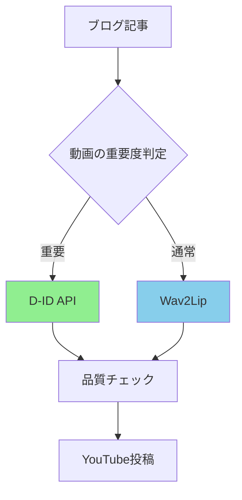

# プラン3: ハイブリッド実装（バランス型・推奨）

**対象者**: 品質とコストのバランスを取りたい方、段階的に技術を習得したい方

**開始までの時間**: 1週間
**初期投資**: ¥50,000-100,000
**月額コスト**: ¥7,000-15,000

---

## このプランの特徴

### メリット
- ✅ コストと品質のバランスが良い
- ✅ 段階的に移行できる（リスク低）
- ✅ 商用サービスと自作の良いとこ取り
- ✅ スケールに応じて柔軟に対応
- ✅ 技術を学びながら実用できる

### デメリット
- ⚠️ 両方の管理が必要
- ⚠️ 初期セットアップに時間
- ⚠️ 中途半端になるリスク

### 最適な用途
- 週3-5本の制作
- 中長期運用予定（6ヶ月以上）
- 技術に興味はあるが本業ではない
- 成長に合わせて最適化したい

---

## ハイブリッド戦略

### 基本コンセプト

```yaml
商用サービス（D-ID/HeyGen）:
  用途:
    - 重要な動画（品質重視）
    - 締切が厳しい動画
    - 複雑な動画
    - バックアップ

  メリット:
    - 確実に高品質
    - 失敗リスクゼロ
    - 時間がかからない

自作システム（Wav2Lip + API）:
  用途:
    - 通常の動画（コスト重視）
    - 実験的な動画
    - 大量生産が必要な時

  メリット:
    - コストが低い
    - 無制限に生成可能
    - カスタマイズ自由
```

---

## 技術スタック

### 推奨構成

```yaml
音声生成:
  主力: OpenAI TTS API
    - 品質: 高
    - コスト: 低（$15/100万文字）
    - 安定性: 高

  バックアップ: ElevenLabs
    - より自然な音声が必要な時

リップシンク:
  主力: Wav2Lip（セルフホスト）
    - コスト: 無料
    - 品質: 十分

  バックアップ: D-ID Lite
    - トラブル時
    - 急ぎの時

動画編集:
  - FFmpeg
  - MoviePy

自動化:
  - n8n
```

---

## 段階的実装プラン

### Phase 1: 商用サービスで開始（Week 1-4）

**目的**: ワークフロー確立と視聴者反応確認

```bash
使用サービス:
  D-ID Lite: $5.9/月

やること:
  ✅ 週1-2本投稿
  ✅ ワークフロー確立
  ✅ 視聴者データ収集
  ✅ 改善点の洗い出し

コスト: ¥1,000-5,000/月
```

---

### Phase 2: 並行開発（Week 5-8）

**目的**: 自作システム構築と比較テスト

```bash
D-ID継続:
  - 本番動画制作は継続
  - 安定した投稿ペース維持

並行作業:
  ✅ GPU環境準備（週末）
  ✅ Wav2Lipセットアップ
  ✅ テスト動画生成
  ✅ 品質比較

コスト: $5.9 + 初期投資（分割可）
```

#### 具体的なスケジュール

```
Week 5:
  平日: D-IDで通常通り動画制作
  週末: GPU環境の調査・購入

Week 6:
  平日: D-IDで動画制作
  週末: WSL2 + Wav2Lipセットアップ

Week 7:
  平日: D-IDで動画制作
  週末: テスト動画1本生成・品質確認

Week 8:
  平日: D-IDで動画制作
  週末: 両方式の比較レポート作成
```

---

### Phase 3: ハイブリッド運用（Week 9-）

**目的**: 最適な使い分けを実現

```yaml
月曜日: 週の動画企画
  - D-ID用: 2本
  - Wav2Lip用: 3本

火-木曜日: 制作
  並行処理:
    D-ID → 重要動画を先に
    Wav2Lip → バッチで3本

金曜日: 確認・調整
  問題あれば D-ID でリカバリ

週末: 来週分の準備
```

---

## 実装詳細

### システム構成



### n8nワークフロー

```yaml
[Manual Trigger] - 動画制作開始
  ↓
[Google Sheets] - 記事リスト読み込み
  ↓
[Code] - 重要度判定
  if (priority === 'high') {
    route = 'did'
  } else {
    route = 'wav2lip'
  }
  ↓
[IF/ELSE 分岐]
  ├─ [D-ID API] - 高品質生成
  └─ [Webhook: Wav2Lip Server] - コスト重視
  ↓
[変数集約器] - 結果を統合
  ↓
[品質チェック]
  ↓
[YouTube API] - 投稿
```

### 重要度判定ロジック

```python
def determine_priority(article_data):
    """
    記事の重要度を判定

    高優先度の条件:
    - ビュー数が多い記事のリメイク
    - 新製品・サービスの発表
    - 期間限定キャンペーン
    - 初めてのトピック

    通常優先度:
    - 定期コンテンツ
    - ハウツー記事
    - 過去動画の焼き直し
    """
    score = 0

    # 条件1: PV数
    if article_data.get('page_views', 0) > 1000:
        score += 2

    # 条件2: 新規性
    if article_data.get('is_new_topic', False):
        score += 2

    # 条件3: タイムセンシティブ
    if article_data.get('time_sensitive', False):
        score += 3

    # 条件4: カテゴリ
    high_priority_categories = ['製品発表', 'キャンペーン', '重要発表']
    if article_data.get('category') in high_priority_categories:
        score += 2

    # 判定
    if score >= 5:
        return 'high'  # D-ID使用
    else:
        return 'normal'  # Wav2Lip使用
```

---

## コスト試算

### 週5本制作の場合

```
内訳:
  重要動画（D-ID）: 週2本 × 4週 = 月8本
  通常動画（Wav2Lip）: 週3本 × 4週 = 月12本

D-ID コスト:
  8本 × 5分 = 40分
  D-ID Pro: $49/月（15分無料 + 追加25分）
  追加料金: 25分 × $0.30 = $7.5
  合計: $56.5 ≈ ¥8,000

自作システム コスト:
  OpenAI TTS: 12本 × 2000文字 × $0.015/1000 = $0.36
  電気代: ¥3,000/月
  合計: ¥3,500

総コスト: ¥11,500/月

比較:
  全部D-ID: ¥25,000/月
  全部自作: ¥5,000/月
  ハイブリッド: ¥11,500/月（中間）

メリット:
  - 重要動画は確実に高品質
  - コストは抑えられる
  - リスク分散
```

---

## Wav2Lipサーバー構築

### Dockerで簡単セットアップ

```dockerfile
# Dockerfile
FROM nvidia/cuda:11.8.0-cudnn8-runtime-ubuntu22.04

# 基本パッケージ
RUN apt-get update && apt-get install -y \
    python3-pip \
    git \
    ffmpeg \
    wget

# Wav2Lipクローン
WORKDIR /app
RUN git clone https://github.com/Rudrabha/Wav2Lip.git
WORKDIR /app/Wav2Lip

# 依存関係
RUN pip install -r requirements.txt

# モデルダウンロード
RUN mkdir -p checkpoints && \
    wget "https://github.com/Rudrabha/Wav2Lip/releases/download/models/wav2lip_gan.pth" \
    -O checkpoints/wav2lip_gan.pth

# APIサーバー
COPY server.py /app/
EXPOSE 8000

CMD ["python3", "/app/server.py"]
```

### Flask APIサーバー

```python
# server.py
from flask import Flask, request, jsonify, send_file
import subprocess
import os
import uuid

app = Flask(__name__)

@app.route('/generate', methods=['POST'])
def generate_video():
    """
    動画生成APIエンドポイント

    Request:
      - avatar_video: アバター動画URL or ファイル
      - audio_file: 音声ファイルURL or ファイル

    Response:
      - video_url: 生成された動画のURL
    """
    try:
        # リクエストパラメータ取得
        avatar_url = request.form.get('avatar_video')
        audio_url = request.form.get('audio_file')

        # 一意なID生成
        job_id = str(uuid.uuid4())

        # ファイルダウンロード
        avatar_path = f"/tmp/{job_id}_avatar.mp4"
        audio_path = f"/tmp/{job_id}_audio.mp3"
        output_path = f"/tmp/{job_id}_output.mp4"

        download_file(avatar_url, avatar_path)
        download_file(audio_url, audio_path)

        # Wav2Lip実行
        cmd = [
            "python", "inference.py",
            "--checkpoint_path", "checkpoints/wav2lip_gan.pth",
            "--face", avatar_path,
            "--audio", audio_path,
            "--outfile", output_path
        ]

        result = subprocess.run(cmd, capture_output=True, text=True)

        if result.returncode == 0:
            # 成功 - ファイル返却
            return send_file(output_path, mimetype='video/mp4')
        else:
            return jsonify({'error': result.stderr}), 500

    except Exception as e:
        return jsonify({'error': str(e)}), 500

def download_file(url, dest):
    """ファイルダウンロード"""
    import requests
    r = requests.get(url)
    with open(dest, 'wb') as f:
        f.write(r.content)

if __name__ == '__main__':
    app.run(host='0.0.0.0', port=8000)
```

### n8nからの呼び出し

```json
{
  "method": "POST",
  "url": "http://localhost:8000/generate",
  "sendBody": true,
  "contentType": "multipart-form-data",
  "bodyParameters": {
    "parameters": [
      {
        "name": "avatar_video",
        "value": "={{$json.avatar_url}}"
      },
      {
        "name": "audio_file",
        "value": "={{$json.audio_url}}"
      }
    ]
  }
}
```

---

## 品質管理

### 自動品質チェック

```python
# quality_check.py

import cv2
import subprocess
import json

def check_video_quality(video_path):
    """
    動画の品質をチェック

    Returns:
        dict: 品質スコアと問題点
    """
    issues = []
    score = 100

    # 解像度チェック
    cap = cv2.VideoCapture(video_path)
    width = int(cap.get(cv2.CAP_PROP_FRAME_WIDTH))
    height = int(cap.get(cv2.CAP_PROP_FRAME_HEIGHT))

    if height < 1080:
        issues.append(f"解像度が低い: {width}x{height}")
        score -= 20

    # フレームレートチェック
    fps = cap.get(cv2.CAP_PROP_FPS)
    if fps < 25:
        issues.append(f"FPSが低い: {fps}")
        score -= 15

    # 音声チェック
    audio_check = subprocess.run(
        ['ffprobe', '-v', 'error', '-show_entries',
         'stream=codec_type', '-of', 'json', video_path],
        capture_output=True, text=True
    )

    streams = json.loads(audio_check.stdout)['streams']
    has_audio = any(s['codec_type'] == 'audio' for s in streams)

    if not has_audio:
        issues.append("音声がない")
        score -= 50

    cap.release()

    return {
        'score': score,
        'issues': issues,
        'pass': score >= 70
    }

# n8nから使用
if __name__ == "__main__":
    import sys
    result = check_video_quality(sys.argv[1])
    print(json.dumps(result))
```

---

## 運用フロー

### 週次スケジュール

```
月曜日（企画）:
  9:00  - ブログ記事5本選定
  10:00 - 重要度判定（2本を高優先度に）
  11:00 - Google Sheetsに登録

火曜日（制作開始）:
  9:00  - n8nワークフロー実行
  9:30  - D-ID 2本が自動生成開始
  10:00 - Wav2Lip 3本をバッチ処理
  15:00 - 生成完了通知受信

水曜日（確認）:
  9:00  - 5本すべて確認
  10:00 - 問題ある動画は再生成
  15:00 - サムネイル作成

木曜日（メタデータ）:
  9:00  - タイトル・説明文生成
  11:00 - 最終確認

金曜日（投稿）:
  9:00  - YouTube予約投稿設定
  　     （月〜金の朝7時公開）

週末（次週準備）:
  土曜: ブログ記事候補リストアップ
  日曜: 休み
```

---

## トラブル時の対応

### パターン1: Wav2Lip生成失敗

```
対応:
  1. D-IDで緊急生成
  2. コストは許容範囲内
  3. スケジュール遅延なし

判断:
  - 締切まで24時間以上 → Wav2Lip再試行
  - 締切まで24時間以内 → D-ID使用
```

### パターン2: D-ID APIダウン

```
対応:
  1. Wav2Lipで代替生成
  2. 品質は若干劣るが許容範囲
  3. 重要動画は延期も検討

判断:
  - 通常動画 → Wav2Lipで生成
  - 重要動画 → 復旧まで待つ or 別日に
```

---

## まとめ

### このプランが向いている人

- ✅ バランス重視
- ✅ 段階的に移行したい
- ✅ 週3-5本ペース
- ✅ 6ヶ月以上継続予定
- ✅ 技術に興味あり（本業ではない）
- ✅ リスクを分散したい

### 3ヶ月後の期待成果

```
技術面:
  ✅ Wav2Lipを使いこなせる
  ✅ n8nで自動化できる
  ✅ 品質管理ができる

コスト面:
  ✅ 月額コスト40%削減
  ✅ 制作本数1.5倍

スキル面:
  ✅ GPU環境構築スキル
  ✅ API統合スキル
  ✅ ワークフロー設計スキル
```

### 今週のアクション

```
Day 1: D-IDで1本制作（現状確認）
Day 2-3: GPU環境の調査・準備
Day 4-5: Wav2Lip環境構築
Day 6-7: テスト生成・比較
```

---

## 関連ドキュメント

- `プラン1_D-ID即スタート.md` - Phase 1の詳細
- `プラン2_オープンソース実装.md` - Wav2Lip詳細
- `n8n自動化ワークフロー.md` - 自動化の実装
- `品質管理ガイド.md` - 品質チェック詳細
