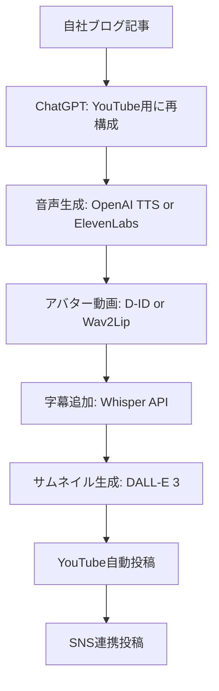

# ブログ記事からYouTube動画への自動変換フロー

**前提**: 自社ブログの既存記事を活用してYouTube動画を制作

---

## 目次

- [1. ワークフロー全体像](#1-ワークフロー全体像)
- [2. ブログ記事→動画スクリプト変換](#2-ブログ記事動画スクリプト変換)
- [3. n8n自動化ワークフロー](#3-n8n自動化ワークフロー)
- [4. 実装手順](#4-実装手順)
- [5. コスト試算](#5-コスト試算)

---

## 1. ワークフロー全体像

### 従来の課題

```
ブログ記事がある → でもYouTubeには手が回らない
理由:
  - 動画用にスクリプト書き直すのが面倒
  - 撮影・編集に時間がかかる
  - 継続が難しい
```

### 解決策: 自動変換システム



**所要時間**:
- 手動: 10分（記事選択 + 確認のみ）
- 自動: バックグラウンドで1時間

---

## 2. ブログ記事→動画スクリプト変換

### ChatGPTプロンプト設計

#### プロンプトテンプレート

```
あなたはブログ記事をYouTube動画スクリプトに変換する専門家です。

【変換ルール】
1. 尺: 8-10分（話し言葉で1800-2000文字）
2. 構成:
   - オープニング (30秒): フック + 今日のテーマ
   - 本編 (7分): 3-5つのポイントに分割
   - クロージング (30秒): まとめ + CTA

3. 話し方:
   - 「です・ます」調
   - 難しい専門用語は噛み砕く
   - 具体例を入れる
   - 視聴者に語りかける口調

4. YouTube最適化:
   - 最初の5秒でフック
   - 重要ポイントは繰り返す
   - 「この動画では〜」と明示

【元記事】
{ブログ記事の本文}

【タイトル】
{記事タイトル}

上記のルールに従って、YouTube動画のスクリプトを作成してください。
```

#### 実行例

**元ブログ記事**:
```
タイトル: AIアバターで動画制作を自動化する3つのメリット

本文:
近年、AIアバターを使った動画制作が注目されています。
従来の動画制作と比較して、以下のようなメリットがあります。

1. コスト削減
撮影機材や編集ソフトへの投資が不要...

2. 時間短縮
撮影のための準備時間が削減...

3. 一貫性の確保
アバターを使うことで常に同じ品質...
```

**変換後のスクリプト**:
```
【オープニング - 30秒】
こんにちは！今日はですね、最近話題のAIアバターについてお話しします。
実は、動画制作を劇的に効率化できる方法があるんです。
この動画を見れば、あなたも今日から動画制作が楽になりますよ。

【本編 - 7分】
AIアバターには大きく3つのメリットがあります。

まず1つ目は、コスト削減です。
従来の動画制作では、カメラやマイク、照明といった機材が必要でしたよね。
でも、AIアバターならそれが不要なんです...

（以下続く）

【クロージング - 30秒】
今日はAIアバターの3つのメリットについてお話ししました。
もう一度まとめると、コスト削減、時間短縮、品質の一貫性でしたね。
もしこの動画が役に立ったら、チャンネル登録お願いします！
それではまた次回！
```

---

### 変換の自動化

#### ChatGPT API実装例

```python
import openai
import os

def blog_to_script(blog_title, blog_content):
    """ブログ記事をYouTubeスクリプトに変換"""

    openai.api_key = os.getenv("OPENAI_API_KEY")

    prompt = f"""
あなたはブログ記事をYouTube動画スクリプトに変換する専門家です。

【変換ルール】
1. 尺: 8-10分（話し言葉で1800-2000文字）
2. 構成:
   - オープニング (30秒): フック + 今日のテーマ
   - 本編 (7分): 3-5つのポイントに分割
   - クロージング (30秒): まとめ + CTA

3. 話し方:
   - 「です・ます」調
   - 難しい専門用語は噛み砕く
   - 具体例を入れる
   - 視聴者に語りかける口調

4. YouTube最適化:
   - 最初の5秒でフック
   - 重要ポイントは繰り返す

【元記事】
タイトル: {blog_title}

本文:
{blog_content}

上記のルールに従って、YouTube動画のスクリプトを作成してください。
スクリプトのみを出力し、説明は不要です。
    """

    response = openai.chat.completions.create(
        model="gpt-4-turbo-preview",
        messages=[
            {"role": "system", "content": "あなたはプロのYouTubeスクリプトライターです。"},
            {"role": "user", "content": prompt}
        ],
        temperature=0.7,
        max_tokens=2500
    )

    script = response.choices[0].message.content
    return script

# 使用例
blog_title = "AIアバターで動画制作を自動化する3つのメリット"
blog_content = """
近年、AIアバターを使った動画制作が注目されています...
（ブログ本文）
"""

youtube_script = blog_to_script(blog_title, blog_content)
print(youtube_script)
```

---

## 3. n8n自動化ワークフロー

### 完全自動版（理想形）

```yaml
トリガー: RSS監視（新規ブログ記事を検知）
  ↓
ブログ記事取得: WordPress API or RSS解析
  ↓
スクリプト変換: ChatGPT API
  ↓
音声生成: OpenAI TTS API
  ↓
動画生成: D-ID API
  ↓
動画ダウンロード: HTTP Request
  ↓
字幕生成: Whisper API
  ↓
字幕付き動画作成: FFmpeg
  ↓
サムネイル生成: DALL-E 3 API
  ↓
メタデータ生成: ChatGPT API
  ↓
YouTube投稿: YouTube Data API
  ↓
SNS投稿: Twitter/Facebook API
  ↓
完了通知: Slack/Telegram
```

### 半自動版（現実的・推奨）

```yaml
トリガー: 手動（またはスケジュール）
  ↓
記事選択: Google Sheets（URL入力）
  ↓
記事取得: HTTP Request
  ↓
スクリプト変換: ChatGPT API
  ↓
[人間確認] スクリプトレビュー（Notion/Google Docs）
  ↓
音声生成: OpenAI TTS API
  ↓
動画生成: D-ID API
  ↓
[人間確認] 動画プレビュー（Telegram通知）
  ↓
承認されたら:
  ↓
  サムネイル生成: DALL-E 3
  ↓
  メタデータ生成: ChatGPT
  ↓
  YouTube投稿
  ↓
  完了通知
```

---

## 4. 実装手順

### Phase 1: 手動プロトタイプ（1日）

**目的**: 1本の動画を手動で作って全体の流れを確認

```bash
ステップ1: ブログ記事を選ぶ
  □ 過去の人気記事を1つ選択
  □ 文字数: 1500-3000文字が最適

ステップ2: ChatGPTでスクリプト変換
  □ 上記のプロンプトを使用
  □ 生成されたスクリプトを確認・微調整

ステップ3: 音声生成
  Option A: OpenAI TTS（手動）
    - https://platform.openai.com/playground
    - スクリプトを入力
    - Voice: "alloy" or "nova"推奨
    - ダウンロード

  Option B: ElevenLabs（手動）
    - https://elevenlabs.io
    - より自然な音声（有料）

ステップ4: D-IDで動画生成
  □ https://studio.d-id.com
  □ アバター画像アップロード
  □ 音声ファイルアップロード
  □ 動画生成・ダウンロード

ステップ5: 確認
  □ 動画を再生して品質確認
  □ リップシンクの精度
  □ 音声の明瞭さ
  □ 全体の雰囲気
```

**所要時間**: 30-60分
**コスト**: ほぼ無料（D-IDの無料枠内）

---

### Phase 2: n8nワークフロー構築（2-3日）

#### n8nセットアップ

```bash
# Docker Composeでn8nを起動（推奨）
version: '3.8'
services:
  n8n:
    image: n8nio/n8n
    restart: always
    ports:
      - "5678:5678"
    environment:
      - N8N_BASIC_AUTH_ACTIVE=true
      - N8N_BASIC_AUTH_USER=admin
      - N8N_BASIC_AUTH_PASSWORD=your-password
    volumes:
      - ~/.n8n:/home/node/.n8n

# 起動
docker-compose up -d

# アクセス
# http://localhost:5678
```

#### ワークフロー実装

**ノード構成例**:

```
1. [Manual Trigger]
   - 手動実行ボタン

2. [Edit Fields] - ブログURLとタイトルを入力
   - blog_url: string
   - blog_title: string

3. [HTTP Request] - ブログ記事取得
   - URL: {{$node["Edit Fields"].json["blog_url"]}}
   - Method: GET

4. [Code] - HTML→テキスト抽出
   ```javascript
   const html = $input.item.json.body;
   // HTMLパース（cheerioなど）
   const text = extractTextFromHTML(html);
   return { text };
   ```

5. [HTTP Request] - ChatGPT API
   - URL: https://api.openai.com/v1/chat/completions
   - Method: POST
   - Body:
   ```json
   {
     "model": "gpt-4-turbo-preview",
     "messages": [
       {
         "role": "system",
         "content": "YouTubeスクリプトライター"
       },
       {
         "role": "user",
         "content": "{{$node["Code"].json["text"]}}"
       }
     ]
   }
   ```

6. [Google Docs] - スクリプト保存
   - Document: "YouTube Scripts"
   - Content: {{$node["HTTP Request"].json["choices"][0]["message"]["content"]}}

7. [Slack/Telegram] - レビュー依頼通知
   - Message: "新しいスクリプトができました！確認してください"

8. [Wait] - 人間の承認待ち
   - Resume On: Webhook

9. [HTTP Request] - OpenAI TTS
   - スクリプト→音声変換

10. [HTTP Request] - D-ID API
    - 音声→動画生成

11. [Wait] - 動画レンダリング待機（3分）

12. [HTTP Request] - D-ID動画取得

13. [Cloudinary] - 動画アップロード

14. [HTTP Request] - DALL-E 3サムネイル生成

15. [YouTube] - 動画投稿

16. [Slack/Telegram] - 完了通知
```

---

### Phase 3: 最適化（1-2週間）

```bash
改善ポイント:

1. バッチ処理
   □ 複数記事を一度に処理
   □ Google Sheetsで記事リスト管理

2. テンプレート化
   □ イントロ/アウトロ動画を固定
   □ BGM自動挿入
   □ 字幕スタイル統一

3. エラーハンドリング
   □ API失敗時のリトライ
   □ タイムアウト対策
   □ エラー通知

4. 品質チェック
   □ 動画長さの確認（5-15分に収まるか）
   □ 音声の音量レベルチェック
   □ サムネイル生成の品質確認
```

---

## 5. コスト試算

### 月10本の動画制作（週2-3本）

#### パターンA: D-ID + OpenAI TTS

```
月額コスト:
  D-ID Pro: $49/月 (¥7,000)
    - 15分のクレジット
    - 1本5分換算で月3本まで無料
    - 追加は$0.30/分 → 7本追加で約¥3,000
    → 合計: ¥10,000

  OpenAI API:
    - TTS: $15/100万文字
      1本2000文字 × 10本 = 20,000文字
      → ¥300/月

    - ChatGPT (スクリプト変換):
      1本¥50 × 10本 = ¥500/月

    - DALL-E 3 (サムネイル):
      1本¥30 × 10本 = ¥300/月

  n8n (セルフホスト): ¥0

合計: 約¥11,000/月
```

#### パターンB: Wav2Lip + OpenAI TTS

```
初期投資:
  GPU環境構築: ¥100,000-150,000

月額コスト:
  OpenAI API (上記と同じ): ¥1,100/月
  電気代・サーバー: ¥5,000/月

合計: ¥6,100/月

損益分岐点:
  (¥150,000) / (¥11,000 - ¥6,100) = 31ヶ月
```

#### パターンC: ハイブリッド

```
月額コスト:
  D-ID Lite: $5.9/月 (¥850)
    - 重要動画のみ（月2-3本）

  Wav2Lip (セルフホスト):
    - 通常動画（月7-8本）

  OpenAI API: ¥1,100/月

合計: 約¥7,000/月

バランス: 品質とコストの良いとこ取り
```

---

## 6. 実際の手順（今週やること）

### Day 1: プロトタイプ作成

```bash
やること:
1. 過去ブログ記事から1つ選ぶ
2. ChatGPTでスクリプト変換
3. OpenAI TTSで音声生成（Playground使用）
4. D-IDで動画生成（無料枠）
5. 結果確認

判断ポイント:
□ ブログ記事の選び方（文字数、トピック）
□ スクリプトの質
□ 音声の品質
□ 動画の品質
□ 所要時間
```

### Day 2-3: n8nセットアップ

```bash
やること:
1. n8n インストール（Docker推奨）
2. API認証設定
   - OpenAI API キー
   - D-ID API キー
   - YouTube API キー
3. 基本ワークフロー作成
4. テスト実行

成果物:
□ 動作するn8nワークフロー
□ 1本の動画を自動生成できる
```

### Day 4-5: 半自動化

```bash
やること:
1. Google Sheetsで記事リスト管理
2. 承認フローの追加
3. 通知システム構築
4. 2-3本まとめて処理

成果物:
□ 週末に次週分をまとめて準備できる
□ 平日は確認・投稿のみ
```

---

## まとめ

### あなたのケースの最適解

```yaml
強み:
  ✅ 既存ブログコンテンツがある
  ✅ スクリプト作成不要（変換のみ）
  ✅ SEOキーワードも既に最適化済み

推奨アプローチ:
  Week 1: D-ID無料枠でプロトタイプ
  Week 2-3: n8n半自動化構築
  Week 4-: D-ID Lite ($5.9/月) で週2本投稿

  3ヶ月後の判断:
    成長している → D-ID Pro or ハイブリッド
    横ばい → D-ID Lite継続
    技術重視 → オープンソース移行
```

---

## 次のアクション

どれから始めますか？

**A) プロトタイプを今日作る**
→ 具体的な手順を画面共有しながら進める

**B) n8nワークフローの詳細設計**
→ ノード構成とJSON設定例を提供

**C) ブログ記事の選び方・最適化**
→ どんな記事が動画向きか、選定基準を作る

**D) コスト最小化を優先**
→ 完全オープンソースの詳細セットアップ
